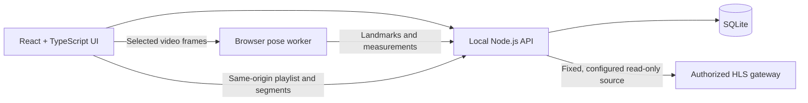

# ResQ

### Human-led incident coordination and scene review

ResQ is a local-first incident-coordination prototype for organizing incident records, responder-reported observations, and follow-up review in one interface. It combines a SQLite-backed incident queue and structured reports with optional on-device pose-landmark measurements from user-selected video.

> **Prototype only:** ResQ is not a medical device, injury detector, or dispatch system. It has not been validated for clinical decisions or emergency response. For an active emergency, contact local emergency services and follow qualified responders' instructions.


## What it does

- **Coordinate incidents:** create, search, update, and close structured incident records in a local SQLite database.
- **Record responder observations:** capture warning signs, broad context, and injury-pattern prompts as reported information—not machine-inferred findings.
- **Support transparent review:** apply deterministic rule matching to explicitly selected warning signs and prompt human review. The rule matcher does not diagnose or rule out injury.
- **Generate reports:** export incident details, the latest saved review, structured observations, and applicable source and limitation information as JSON.
- **Review video locally:** optionally estimate pose landmarks from a user-selected MP4 or WebM in the browser. Only analysis metadata and landmark outputs are sent to the local API; source video bytes are not uploaded.
- **Preview an authorized camera:** optionally display one HLS stream from a configured gateway through a same-origin server proxy. This is read-only playback, not camera or alarm control.

## Interface at a glance

The workspace brings the incident queue, scene preview, responder-entered review, and coordination prompts together:

```text
┌──────────────────┐   ┌────────────────────────┐   ┌─────────────────────┐
│ Incident queue   │ → │ Scene and video review │ → │ Responder review    │
│ Search / status  │   │ Demo, upload, or HLS   │   │ Observations / save │
└──────────────────┘   └────────────────────────┘   └─────────────────────┘
                                  │                              │
                                  └──────── Local API ───────────┘
                                           │
                                      SQLite + JSON
```

## Technology and data flow



Pose analysis runs in the browser using the MediaPipe Pose Landmarker Lite artifact. The HLS proxy keeps the configured upstream URL and optional authorization header out of browser responses; it does not add user authentication or access control to this prototype.

## Quick start

### Requirements

- Node.js **22.12 or later**
- A modern browser
- Internet access on first dependency install; optional model/runtime downloads are described below

The API uses Node's built-in `node:sqlite`. In Node.js 22 it emits an expected experimental warning at startup; this warning is documented and intentionally not hidden.

### Run locally

```sh
npm install
npm run dev
```

Open [http://127.0.0.1:5180](http://127.0.0.1:5180). The development command starts the Vite UI and local API together. The API binds to `127.0.0.1:4174`, and Vite proxies `/api` requests to it.

Useful commands:

| Command | Purpose |
| --- | --- |
| `npm run dev` | Start the UI and API for local development |
| `npm test` | Run API and HLS gateway integration tests |
| `npm run lint` | Run Oxlint |
| `npm run build` | Type-check and build the production UI |
| `npm start` | Build and start the production preview with the API |

The SQLite database is created at `data/resq.sqlite` and is ignored by Git. Set `RESQ_DB_PATH` to use another local database file.

## Optional: on-device pose measurements

Download the reviewed model artifact before selecting **Analyze on device**:

```powershell
.\scripts\download-pose-model.ps1
```

The download script verifies the expected artifact size and SHA-256. The model is stored under `public/models/` and is intentionally excluded from Git. The browser samples up to 15 frames from an MP4 or WebM (maximum 100 MB and five minutes) and runs pose estimation locally. The API stores analysis status, sampled landmarks, and derived normalized image-coordinate measurements—not the uploaded video.

The model is a general-purpose pose estimator, not an injury or cause classifier. Its training-data provenance is unspecified by the selected artifact; ResQ does not claim that it uses injury data or has been validated for injury assessment. The pinned MediaPipe worker and WebAssembly runtime are fetched from jsDelivr. See [pose analysis and data provenance](docs/pose-analysis.md).

## Optional: authorized read-only CCTV preview

ResQ accepts one HLS playlist (`.m3u8`) from a gateway configured by an authorized operator. It does not connect directly to an RTSP camera. For example, to configure a local development session in PowerShell:

```powershell
$env:RESQ_CAMERA_HLS_URL = "https://gateway.example.test/front/index.m3u8"
$env:RESQ_CAMERA_LABEL = "Front entrance"
# Optional: supply a protected secret; never commit a real credential.
$env:RESQ_CAMERA_AUTHORIZATION = "Bearer <your-token>"
npm run dev
```

Optional metadata settings are `RESQ_CAMERA_GATEWAY_ID` and `RESQ_CAMERA_STREAM_ID`. Set `RESQ_CAMERA_ENABLED=false` to disable the source. The URL must be credential-free and have no query string or fragment. The API checks the playlist before connecting, proxies HLS resources through same-origin opaque paths, and does not return the upstream URL or configured authorization header to the browser. The UI reports **LIVE PREVIEW** only during actual playback.

The authorization acknowledgement in the interface is **not** authentication or access control. This application has no user accounts, roles, or access audit trail. Keep it bound to a trusted local environment; do not expose ResQ or the configured feed to an untrusted network. See [authorized camera setup and limitations](docs/camera-feed.md).

## Structured catalog and review

`data/guidance-catalog.json` is imported into SQLite at API startup. It provides versioned incident mechanisms, broad context categories, responder-observed injury-pattern prompts, and warning-sign prompts with references and explicit demonstration/unvalidated status. Catalog entries are not clinical guidance and do not replace current protocols.

The rule matcher uses warning signs a person explicitly selects. Other observations are stored as responder-reported data and do not change the rule result. An urgent prompt requests human review; no prompt must never be interpreted as evidence that a person is safe. Existing databases receive additive schema updates when new structured review fields are introduced.

## Responsible-use boundaries

> **This prototype provides computer-vision measurements where supported. Pose estimates are not injury diagnoses. The system has not been validated for clinical decisions or emergency dispatch.**

- ResQ does not infer injury, cause, severity, treatment, recovery time, identity, age, gender, or emotional state from video.
- Camera previews are operator-reviewed and read-only. ResQ does not control cameras, trigger alarms, or operate local devices.
- The thermal display is a visual demonstration only; it is not thermal sensing.
- Dataset downloads are not bundled or relabeled as injury data. Action-recognition data is not clinical injury evidence.
- Do not enter real patient identifiers or sensitive video into this unauthenticated local prototype.

See the [draft intended-use and data-governance specification](docs/intended-use-and-data-governance.md) for dataset acceptance criteria, evaluation gates, and future-use requirements.

## Project map

```text
src/       React UI, browser video workflow, and on-device pose worker
server/    Node.js API, SQLite persistence, and HLS gateway proxy
data/      Versioned structured guidance catalog
docs/      Camera, pose-analysis, and data-governance notes
scripts/   Verified local pose-model download
```

## Validation

Run the checks locally:

```sh
npm test
npm run lint
npm run build
```

The current [runtime validation report](runtime-validation-report.md) records the tested local API and browser flows, HLS proxy checks, bundle-size comparison, and known gaps. No physical camera or real CCTV gateway is certified by those tests.
